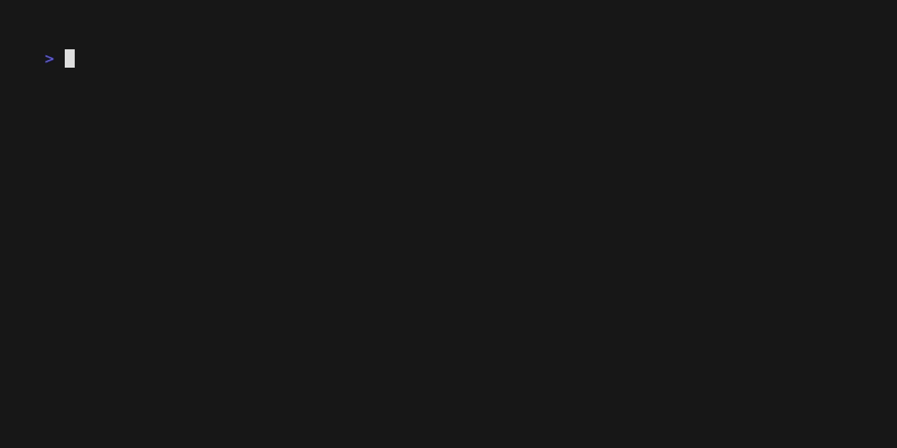

# SPENCER - System Provisioning Engine for Nun Components & Embedded Runtime

<p align="center">
  
</p>

SPENCER is a comprehensive OS construction system that integrates the A9N Microkernel, Nun OS Runtime, and architecture-appropriate boot software.

It automatically generates executable OS images, significantly simplifying the development of embedded systems based on A9N.

## Architecture Overview

- [**A9N Microkernel**](https://github.com/horizon2038/A9n): Capability-based 3rd-generation microkernel

- [**Nun OS Framework**](https://github.com/horizon2038/Nun): OS runtime framework for building embedded operating systems on top of the A9N microkernel

- [**A9NLoader-rs**](https://github.com/horizon2038/a9nloader-rs): x86_64 UEFI bootloader for A9N-based systems
- **U-Boot**: aarch64 secondary bootloader

SPENCER ties these together using a single build interface (`cargo xtask`),
producing a bootable image automatically.

## Build

```bash
cargo xtask build \
    --arch {ARCH, e.g., x86-64} \
    --platform {PLATFORM, e.g., qemu} \
    [--enable-smp] \
    --{release|debug}
```

For example, the AArch64 QEMU build is:

```bash
cargo xtask build --arch aarch64 --platform qemu --release
```

The Raspberry Pi 4 Model B build is:

```bash
cargo xtask build --arch aarch64 --platform rpi4b --release
```

This builds A9N, the Nun OS payload, and U-Boot, then creates:

```text
out/aarch64-qemu-release/
├── a9n/
│   ├── kernel.elf
│   └── kernel.img
├── u-boot/
│   └── u-boot.bin
└── spencer.img
```

The AArch64 `spencer.img` contains U-Boot legacy boot scripts, `u-boot.bin`,
`kernel.img`, and the Init ELF. QEMU `virt` still receives the generated
`u-boot.bin` separately as firmware because firmware loading and block-device
loading are distinct QEMU interfaces.

### Running with QEMU

```bash
cargo xtask run \
    --arch {ARCH, e.g., x86-64} \
    --platform qemu \
    --{release|debug}
```

The default run exposes one virtual CPU. A multi-core A9N run requires both the
Kernel build switch and the QEMU CPU count:

```bash
cargo xtask run \
    --arch aarch64 \
    --platform qemu \
    --release \
    --enable-smp \
    --smp 4
```

`--enable-smp` configures A9N with `A9N_CONFIG_ENABLE_SMP=ON`. `--smp <N>`
sets QEMU's virtual CPU count and defaults to 1. A value greater than 1 is
rejected unless `--enable-smp` is also present. This applies to both x86_64
and aarch64 QEMU runs. AArch64 QEMU discovers the CPUs from the U-Boot DTB and
starts secondary CPUs with PSCI.

Hardware acceleration is controlled with:

```text
--accel auto|on|off
```

The default `auto` mode uses the host's QEMU hardware accelerator when the host
and guest architectures match, and otherwise uses TCG. `on` requires a usable
hardware accelerator and reports an error when none is available. `off` always
uses TCG. Spencer does not retry with TCG when a selected hardware accelerator
fails; rerun with `--accel off` to fall back explicitly.

### U-Boot source and Docker build

For an AArch64 build, SPENCER resolves U-Boot in the following order:

1. `UBOOT_QEMU_BIN` or `UBOOT_RPI4B_BIN`, as a platform-specific prebuilt
   override.
2. `UBOOT_BIN`, as a generic explicit prebuilt override.
3. `UBOOT_SOURCE`, as an explicit U-Boot source tree.
4. `tools/u-boot`, when it is a source tree; QEMU also accepts the legacy
   `tools/u-boot/u-boot.bin`, while Raspberry Pi accepts
   `tools/u-boot/rpi4b/u-boot.bin`.
5. A shallow checkout of U-Boot `v2025.10` from the official repository.

Source builds run in a Linux Docker container and use an out-of-tree build
directory. SPENCER builds the container from
`xtask/docker/u-boot.Dockerfile`, which provides the AArch64 cross compiler and
all U-Boot host dependencies. No U-Boot compiler, GNU Make, OpenSSL, or GnuTLS
installation is required on the host. SPENCER selects `qemu_arm64_defconfig`
for `--platform qemu` and `rpi_4_defconfig` for `--platform rpi4b`.

```bash
UBOOT_SOURCE=/path/to/u-boot \
cargo xtask build --arch aarch64 --platform qemu --release
```

`UBOOT_DOCKER` overrides the Docker-compatible executable and `UBOOT_JOBS`
overrides the parallel job count. `UBOOT_DOCKER_IMAGE` selects an existing
builder image and skips building SPENCER's default image.

The generic `UBOOT_BIN` remains available and takes precedence over source
builds, so Docker is not required when a prebuilt U-Boot binary is supplied.

### Raspberry Pi 4 Model B

For `--arch aarch64 --platform rpi4b`, SPENCER builds U-Boot with
`rpi_4_defconfig` and creates:

```text
out/aarch64-rpi4b-release/
├── a9n/
│   ├── kernel.elf
│   └── kernel.img
├── raspberrypi-firmware/
│   └── boot/
├── u-boot/
│   └── u-boot.bin
└── spencer.img
```

SPENCER automatically makes a sparse clone of the official
`raspberrypi/firmware` repository at the pinned `1.20260521` release and caches
it under `build/raspberrypi-firmware/`. Set `RPI_FIRMWARE_DIR` to an existing
firmware repository root or its `boot` directory to override the automatic
checkout.

The first FAT32 partition in `spencer.img` contains `start4.elf`, `fixup4.dat`,
the BCM2711 device tree, U-Boot as `kernel8.img`, the
U-Boot boot script, A9N, and the Init ELF. Write `spencer.img` to the whole SD
card with Raspberry Pi Imager or another raw-image writer; copying the image as
a regular file does not create bootable media.

Serial output uses the BCM2711 PL011 on GPIO14 (TX) and GPIO15 (RX) at
115200 8N1. The generated `config.txt` applies `disable-bt` so that PL011 is
routed to the GPIO header and fixes its input clock at 48 MHz. Use
a 3.3 V USB-to-UART adapter and connect a common ground. Do not connect a 5 V
serial signal to the Raspberry Pi GPIO header. `cargo xtask run` remains a QEMU
command, so physical Raspberry Pi targets use `cargo xtask build` followed by
writing the image to removable media.

Build an SMP-enabled Raspberry Pi 4 image with:

```bash
cargo xtask build \
    --arch aarch64 \
    --platform rpi4b \
    --release \
    --enable-smp
```

The AArch64 HAL reads the four BCM2711 CPU nodes and their
`cpu-release-addr` values from the firmware DTB, releases the three secondary
CPUs through the spin table, and initializes a private GICv2 CPU interface,
generic timer, CPU-local state, scheduler, IDLE context, and kernel stack on
each core.

### Debugging with GDB
```bash
cargo xtask gdb \
    --arch {ARCH, e.g., x86-64} \
    --platform qemu \
    --{release|debug} \
    --gdb --stop
```

## Advanced Usage

### Injecting an external OS payload

By default, SPENCER builds the template OS payload from `./core/Cargo.toml`
and installs the produced `core` binary as `/kernel/init.elf` in the generated
FAT image.

For projects that use SPENCER as a build/image/run toolchain, the OS payload
can be supplied from outside the SPENCER repository:

```bash
cargo xtask build \
    --arch x86-64 \
    --platform qemu \
    --release \
    --os-manifest /path/to/os/Cargo.toml \
    --os-target-json /path/to/x86_64-unknown-a9n.json \
    --os-binary my_os
```

The same options are accepted by `cargo xtask run`:

```bash
cargo xtask run \
    --arch x86-64 \
    --platform qemu \
    --release \
    --os-manifest /path/to/os/Cargo.toml \
    --os-target-json /path/to/x86_64-unknown-a9n.json \
    --os-binary my_os
```

Options:

- `--os-manifest`: Cargo manifest of the external OS payload. If omitted,
  SPENCER uses `./core/Cargo.toml`.
- `--os-target-json`: custom Rust target JSON for the OS payload. If omitted,
  SPENCER uses `./Nun/arch/<arch>-unknown-a9n.json`.
- `--os-binary`: output binary name produced by the OS payload package. If
  omitted, SPENCER uses `core`.

The external payload is built into SPENCER's normal output directory:

```text
out/<arch>-<platform>-<profile>/nun_os_target_dir/<target>/<profile>/<os-binary>
```

The image builder then writes that binary directly to:

```text
/kernel/init.elf
```

No post-build image patching is required.

If the custom target JSON uses linker script paths in `pre-link-args`, prefer
absolute paths or paths that are valid from the external payload build context.
This avoids depending on Cargo/rust-lld's current working directory.

## Supported Architectures and Platforms

Currently supported architectures and platforms include:

### Architectures

- `x86_64`
- `aarch64`

### Platforms

- `qemu` (`pc99` for x86_64, `virt` for aarch64)
- `rpi4b` (Raspberry Pi 4 Model B for `aarch64`)

### Planned Support

- `riscv64` (QEMU, real hardware)

- Non-specific embedded platforms

## License

[MIT License](https://choosealicense.com/licenses/mit/)
